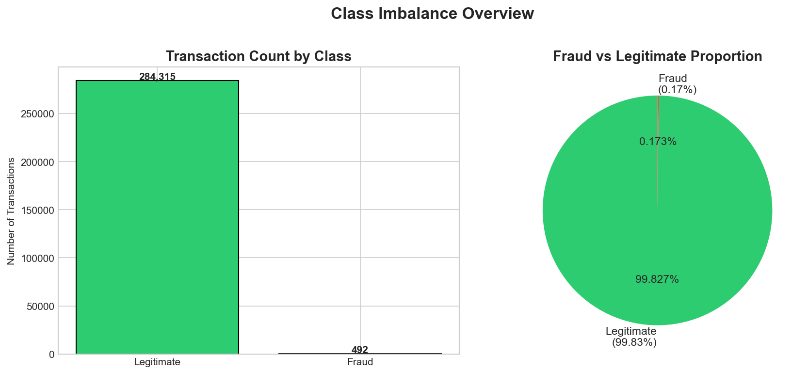
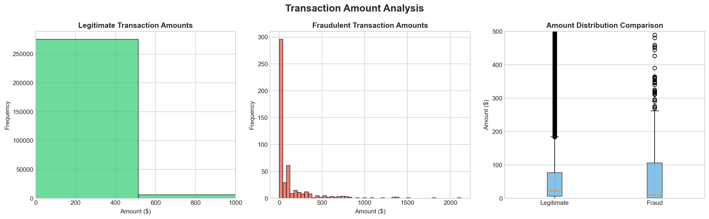
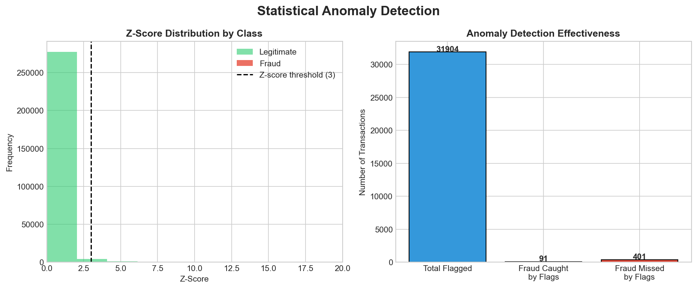
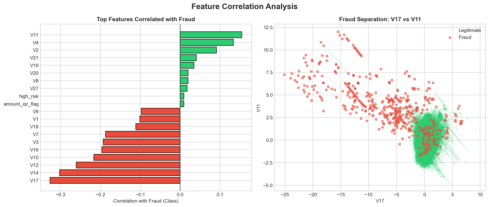
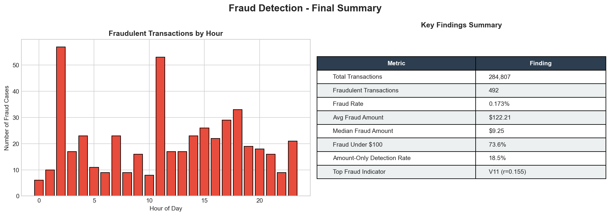

# Credit Card Fraud Detection

Python analysis of 284,807 real credit card transactions to identify 
fraud patterns and evaluate detection methods.

---

## Why this project

Working in healthcare billing, I spent a lot of time looking at claim 
patterns — what gets flagged, what slips through, and why simple rules 
miss things that are obvious in the data. I wanted to see if those same 
instincts applied to financial fraud and see where amount-based 
detection actually breaks down.

It breaks down a lot.

---

## Setup

```bash
git clone https://github.com/fi2233fi/fraud-detection-analysis.git
cd fraud-detection-analysis
pip install pandas numpy matplotlib seaborn scipy
```

Dataset not included due to file size. Download from
[Kaggle](https://www.kaggle.com/datasets/mlg-ulb/creditcardfraud) 
and place `creditcard.csv` in the project folder.

```bash
python fraud_analysis.py
```

---

## What the data looks like

| | Value |
|---|---|
| Total transactions | 284,807 |
| Fraud cases | 492 (0.173%) |
| Missing values | 0 |
| Features | 30 behavioral (PCA) + Amount + Time |

---

## Key findings

**Fraudsters stay small on purpose**
Median fraud transaction was $9.25. Nearly 74% of fraud happened under 
$100. This is card testing — stolen credentials get validated with 
micro-purchases before anyone tries anything larger.

**Amount-based rules miss most fraud**
Flagging by transaction amount caught 18.5% of fraud cases and generated 
31,904 alerts in the process. That's a 0.3% precision rate — basically 
noise. Any fraud team working off those alerts would be buried.

**Behavioral patterns are the actual signal**
The strongest fraud indicators came from behavioral transaction features, 
not transaction amount. These patterns captured how a purchase was made 
rather than how much was spent, and they separated fraud from legitimate 
transactions far more cleanly than any dollar threshold.

---

## Recommendations

- Drop amount-only flagging rules — they are not working
- Shift focus to behavioral transaction patterns rather than amount 
  thresholds — the data shows these are far more predictive of fraud 
  than how much was spent
- Build a tiered alert system so low-confidence flags get monitored 
  passively instead of going straight to review
- Flag accounts with 3+ transactions under $10 within an hour as 
  potential card testing activity
- Any future ML model needs rebalanced training data — 0.17% fraud 
  rate will produce a model that predicts legitimate every time

---

## Charts







---

*The same pattern recognition logic applies directly to healthcare 
claims, insurance billing, and any high-volume transaction environment 
where bad actors learn the rules and adapt to them.*
